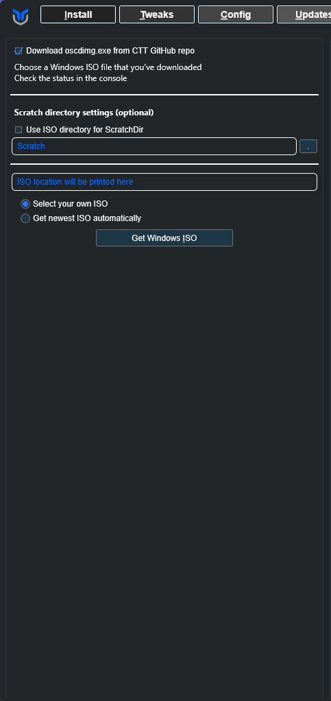
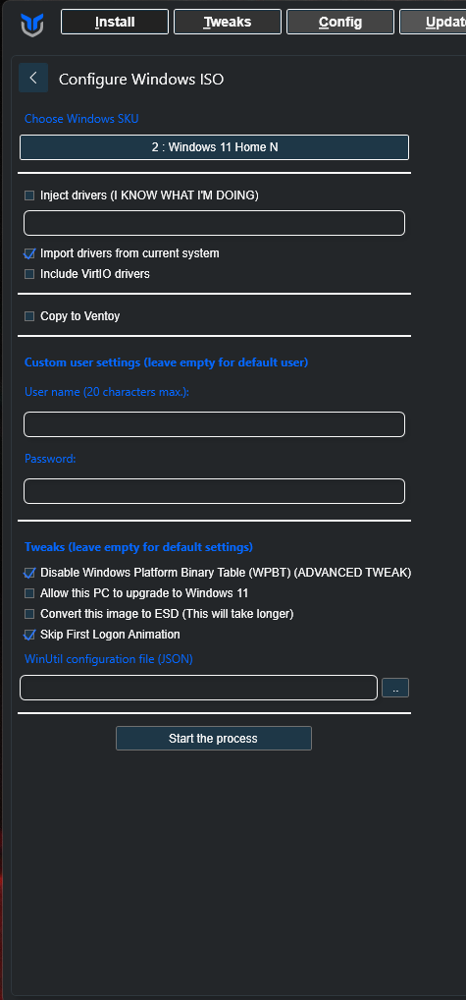
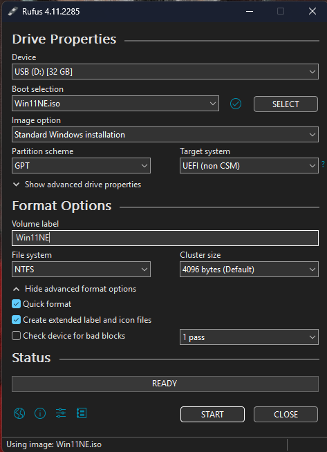
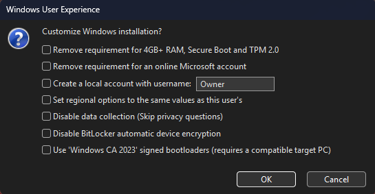
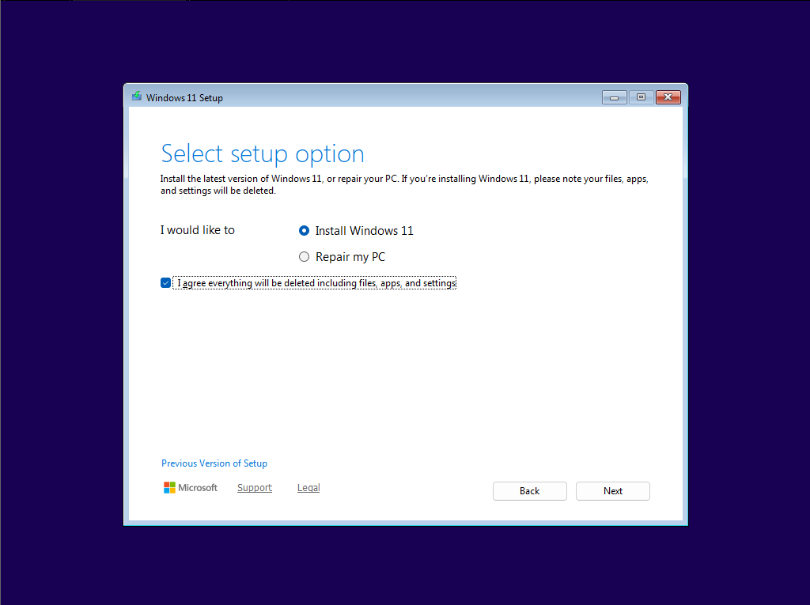
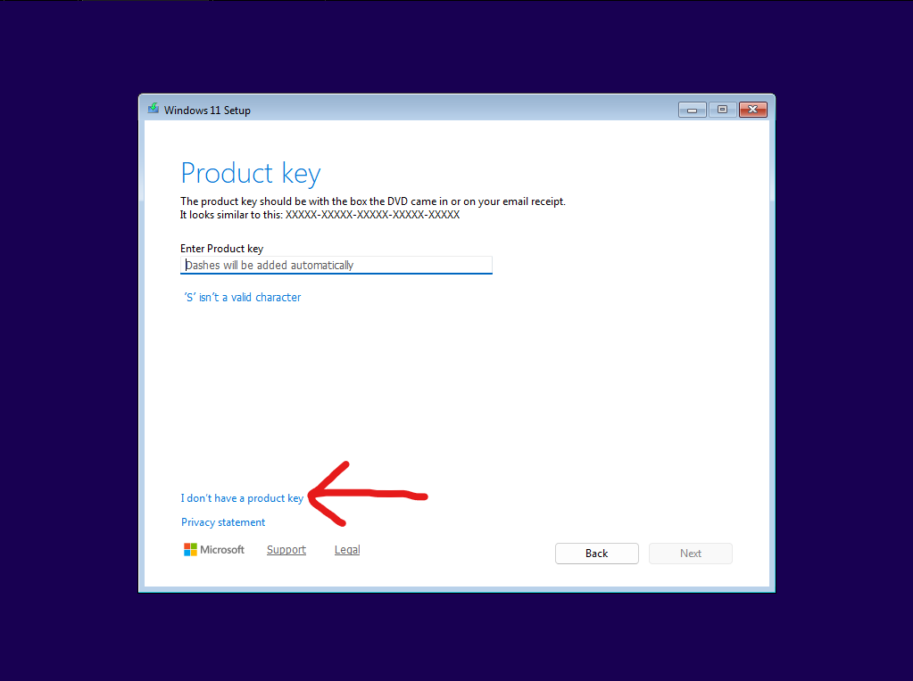
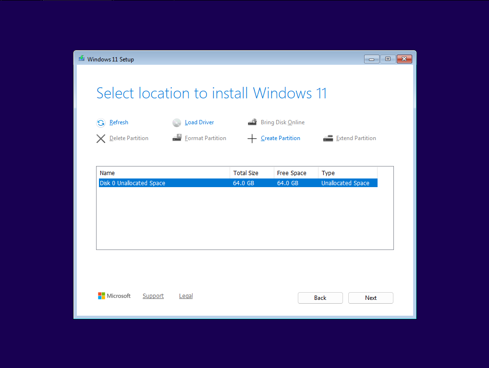

# Path 2 – Windows 11 (Clean Install)

This path is for users who are **already on Windows 11** and are comfortable starting fresh.

A clean install provides the **cleanest, most predictable baseline**, but it requires preparation and attention. Read each step carefully.

---

## ⚠️⚠️⚠️ Before You Begin ⚠️⚠️⚠️

This process **will erase the selected system drive**.

Before continuing, make sure you have:
- Completed all backup steps  
- Verified your backups are accessible from another device  
- Read through this path once start to finish  

➡️ **Backup instructions:**  
[How to Backup](backup.md)

---

## Important Note – Network Drivers

This Windows 11NE install is **stripped down**.  
On some systems, **Wi-Fi drivers may not be available during setup**.

Before you start:

✅ **Strongly recommended**
- Download your **Wi-Fi or Ethernet network drivers**
- Save them to a **separate USB drive**

✅ **Alternative**
- Use a **wired Ethernet connection** during first boot
- You can install drivers immediately after setup

This avoids being stranded offline after installation.

---

## Step 1 – Prepare Installation Media

### What You’ll Need
- A USB flash drive (8GB minimum, 16GB recommended)
- A working Windows system

---

### 1. Making the Custom ISO

1. Download Windows 11 from the [Microsoft website](https://www.microsoft.com/software-download/windows11)
2. Go to **Download Windows 11 Disk Image (ISO) for x64 devices**
3. Select **Windows 11 Multi Edition** and click **Confirm**
4. Select your language and click **Confirm**
5. Click the **64 Bit Download** button

### 1.2 Microwin
1. Open **PowerShell** or **Terminal** as Administrator  
   - Right-click **Start** → **Windows Terminal (Admin)**

2. Run this command:

   ```powershell
   irm "https://christitus.com/win" | iex
   ```

3. Click **MicroWin** at the top
4. Your inital setup with look like this



5. Click **Get Windows ISO**
6. Select your downloaded ISO and after that your screen will change just copy my settings shown below (If you want to make a custom username and password you can do so now)



7. Click **Start the Process** and name your custom ISO 

Give it some time but after that is done and completed you can continue to step 2.

---

### 2. Download Rufus

Download Rufus from the official site:

➡️ https://rufus.ie/en/

---

### 3. Create the Bootable USB

1. Launch **Rufus**
2. Select:
   - **Device:** Your USB drive  
   - **Boot selection:** Windows 11NE ISO  
3. Configure Rufus **exactly as shown below**




4. Click **Start**

When prompted with **Windows User Experience options**:
- **Uncheck every box**
- Click **OK**

⛔ Do not enable bypasses or automation options.

Wait for Rufus to complete.

---

## Step 2 – Boot Into the Installer

Once the USB is ready, choose **one** of the following methods:

### Option A – Boot Key (Recommended)
Restart your system and press your boot menu key:

Common keys:
- **F12** – Custom / Dell / Lenovo
- **F11** – MSI
- **F8** – ASUS
- **Esc** – HP
- **F9** – Some OEM systems

Select the USB device.

---

### Option B – Advanced Startup (From Windows)

1. Open **Settings**
2. Go to **System → Recovery**
3. Click **Restart now** under Advanced startup
4. Choose:
   - **Use a device**
   - Select your USB installer

---

## Step 3 – Windows 11 Setup

Follow the installer prompts as shown in the images below.

### Setup Options
- Select **Install Windows 11**
- Check ✅ **I agree that everything will be deleted (files, apps, and settings)**



### Product Key
- When prompted, click:
  **I don’t have a product key**

Windows should activate automatically later.




---

## Step 4 – Disk Selection (READ CAREFULLY)

This is the **most important step**.

Your screen may show:
- Multiple disks  
- Multiple partitions  
- The USB installer  

### What You Need to Do

1. Identify the disk containing your **old Windows installation**
2. Look under the **Type** column for:
   - Recovery
   - System
   - MSR

These partitions will all belong to the same disk  
(e.g., **Disk 0**, **Disk 1**)

3. Select **each partition** on that disk and click **Delete**
4. Continue until the disk shows:
   - **Unallocated Space**

✅ When only unallocated space remains on the target disk:
- Select it
- Click **Next**



⚠️ **Do NOT delete partitions on other disks unless you intend to wipe them.**

---

## Step 5 – Installation & First Boot

Windows will now:
- Copy files
- Reboot multiple times
- Complete setup automatically

Once finished, you’ll enter **OOBE (Out-of-Box Experience)**.

With this stripped-down build:
- You may be prompted for a **username and password**, or  
- A default account may be created  

Either is fine we’ll adjust later if needed.

---

## Step 6 – First Login & Network Setup

Once on the desktop:
- Connect to the internet (Ethernet or Wi-Fi driver USB)
- Install your network driver if necessary
- Allow initial Windows updates to complete

---

## Step 7 – Proceed With Post-Install Setup

### 7.1 GPU Drivers

#### Identify Your GPU

1. Right-click **Start** → **Device Manager** or use **WINDOWS KEY** and **X**
2. Expand **Display adapters**
3. Note the GPU name:
   - NVIDIA
   - AMD
   - Intel

#### Get the Correct Driver

**Laptop or prebuilt desktop**
- Go to the manufacturer’s support page (Dell, ASUS, Lenovo, etc.)
- Search your **exact model**
- Download the latest **Windows 11 graphics driver**

**Custom-built desktop**
- NVIDIA → Official NVIDIA driver download page
- AMD → Radeon driver download page
- Intel → Arc / iGPU driver download page

Install the driver you downloaded and **reboot**.

⚠️ If installing NVIDIA make sure to use the custom install and make sure to select the clean install option. 

---

### 7.2 Chipset / Motherboard Drivers

**For desktops**
1. Go to your motherboard vendor’s support page (ASUS, MSI, Gigabyte, etc.)
2. Download and install:
   - Chipset drivers
   - ME / AM4 / AM5 / Intel Platform drivers (if offered)

**For laptops**
- Use the OEM support page
- Install chipset / platform drivers listed for your model

---

### 7.3 Audio & Capture Card Drivers

Install or update drivers from:
- Your **audio interface** or **sound card** vendor
- Your **USB microphone** vendor (if it uses a driver)
- Your **capture card** vendor (Elgato, AverMedia, etc.)

Reboot after installing drivers.

---

## Why We Do This (Drivers)

- Windows Update often installs **generic drivers** that technically work but perform poorly

Known-good vendor drivers eliminate many:
- Stutter issues
- Random crashes
- “OBS hates me today” problems

---

# Windows 11NE – WinUtil Tweaks Profile

This section describes **exactly** how to run Chris Titus Tech’s WinUtil 

Do **not** enable extra options beyond what’s listed here unless you know what you’re doing.

---

## 1. Launch WinUtil

1. Open **PowerShell** or **Terminal** as Administrator  
   - Right-click **Start** → **Windows Terminal (Admin)**

2. Run this command:

   ```powershell
   irm "https://christitus.com/win" | iex
   ```

3. Click on the **Tweeks** tab and select standard and then make your's look how the image below does.


4. Click **Run Tweeks**
5. Click **Run OO Shutup 10**
6. Click **File** and **Import Profile**
7. [Download ooshutup10.cfg](https://github.com/HaittaNeo/Windows-11NE/blob/main/paths/path-1-win11-no-reinstall/ooshutup10.cfg) By clicking the link and clicking download raw file


8. Import the downlooaded config file
9. Restart computer after everything has been applied and done

---

## ✅ After Path 2

You now have:
- A clean and debloated Windows install
- No legacy upgrade issues
- Full control over drivers and configuration

⬅️ [Back to Main README](../../README.md)
